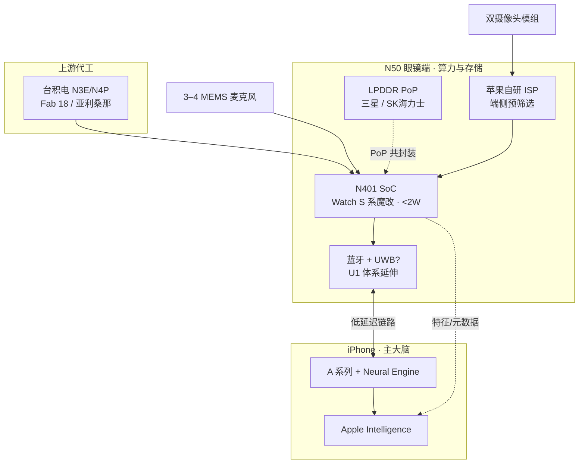

# 01-算力与存储 · 子系统总览

> 苹果 N50 智能眼镜（内部代号 N50/N401）眼镜端「大脑」：采集侧轻算力、端侧预筛选、与 iPhone 低延迟协同。

---

## 1. 模块概述

本子系统覆盖眼镜端全部半导体与无线连接能力：**主控 SoC（N401）**、**先进制程（台积电 3nm/N4P）**、**低功耗内存（LPDDR 共封装）**、**自研 ISP**、**蓝牙 + 传闻 UWB**。设计哲学是「眼镜有芯片，重 AI 在 iPhone」——眼镜负责唤醒、图像预筛选、音频与传感器融合，Neural Engine 级推理交由配对 iPhone 完成。

| 子模块 | 文档 | 核心职能 |
|--------|------|----------|
| 主控 | [SoC-N401主控芯片.md](./SoC-N401主控芯片.md) | Watch S 系魔改、整机功耗预算 |
| 制程 | [制程-台积电3nm.md](./制程-台积电3nm.md) | N3E/N4P 代工、产能与成本 |
| 内存 | [内存-LPDDR共封装.md](./内存-LPDDR共封装.md) | PoP 共封装、待机功耗 |
| 视觉算力 | [ISP图像信号处理.md](./ISP图像信号处理.md) | 双摄管线、端侧预筛选 |
| 连接 | [无线-蓝牙与UWB.md](./无线-蓝牙与UWB.md) | 与 iPhone 链路与空间感知 |

---

## 2. 子系统关系图

---

## 3. 传闻规格一览（子系统级）

| 维度 | 传闻要点 | 置信度 |
|------|----------|--------|
| 代号 | N401（产品 N50） | 高 |
| 架构来源 | Apple Watch S10/S9 SiP 路线魔改 | 高 |
| 整机 SoC 功耗 | <2 W（峰值），持续数百 mW 级 | 中高 |
| 制程 | 台积电 3nm N3E 或 N4P | 中 |
| 内存 | 定制 LPDDR5X，PoP 叠封 | 中 |
| 无线 | 蓝牙必选；UWB 为产业链推演 | 中 |

---

## 4. 与竞品算力路线对比

| 项目 | 苹果 N50 | Meta Ray-Ban（AR1 Gen 1） |
|------|----------|---------------------------|
| 主控 | 自研 N401 | 高通 Snapdragon AR1 |
| 系统功耗目标 | <2 W（SoC 级传闻） | <1 W（平台级，Qualcomm） |
| AI 重心 | iPhone Neural Engine | 端侧小模型 + 手机协同 |
| 制程代际 | 传闻 3nm（2027） | 6nm 级（AR1 公开资料） |

---

## 5. 供应链一句话

**台积电（晶圆）→ 三星/SK海力士（DRAM die）→ 苹果（SiP 设计/封测整合）→ 立讯/歌尔等 EMS 贴装 → 用户 + iPhone**。

---

## 6. 子模块文档索引

- [SoC-N401主控芯片.md](./SoC-N401主控芯片.md)
- [制程-台积电3nm.md](./制程-台积电3nm.md)
- [内存-LPDDR共封装.md](./内存-LPDDR共封装.md)
- [ISP图像信号处理.md](./ISP图像信号处理.md)
- [无线-蓝牙与UWB.md](./无线-蓝牙与UWB.md)

---

*基于公开传闻整理，非苹果官方 | 版本 v1.0 | 2026-05-29*
