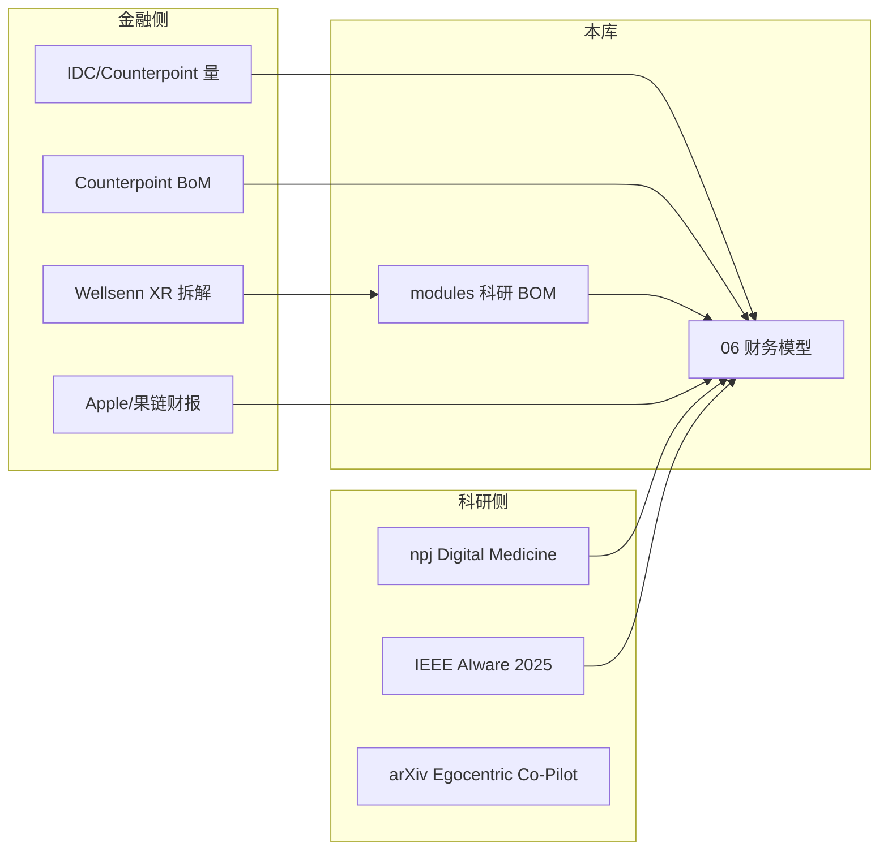

# N50 智能眼镜 · 投研一体化资料库

> **非投资建议 · 非苹果官方**  
> 本目录将 **金融卖方/拆解研报数据** 与 **科研论文/技术综述** 合并为同一套引用体系。  
> **原则：有出处才写数字；无出处标「推演」；绝不把推演当事实。**

---

## 数据置信度分级

| 等级 | 含义 | 示例来源 |
|------|------|----------|
| **A** | 一手/官方披露 | Apple SEC 10-Q、港交所年报、Counterpoint 经媒体引述的 BoM Service |
| **B** | 专业拆解/卖方 | Wellsenn XR（经 CMBI、首创证券、产业链转载）、郭明錤/路透转 Bloomberg |
| **C** | 媒体汇总/二手 | Communications Today、MacRumors、行业博客 |
| **D** | 本库 BOM 推演 | `modules/*/科研/` 成本模型，**非苹果或券商确认** |

阅读任何毛利率、BOM、出货量时，先看表格中的 **等级** 列。

---

## 文档索引

| 文件 | 内容 | 数据类型 |
|------|------|----------|
| [01-数据来源与引用规范](./01-数据来源与引用规范.md) | 引用格式、禁止事项 | 方法 |
| [02-市场规模与竞争格局](./02-市场规模与竞争格局.md) | IDC/Counterpoint 出货量、份额 | A/C |
| [03-竞品BOM与硬件毛利率](./03-竞品BOM与硬件毛利率.md) | Ray-Ban Meta 拆解、Wellsenn 结构 | A/B |
| [04-苹果财务与Wearables基准](./04-苹果财务与Wearables基准.md) | 苹果财报毛利率、Wearables 收入 | A |
| [05-果链供应商财报映射](./05-果链供应商财报映射.md) | 歌尔/立讯/高伟 毛利率与业务 | A |
| [06-N50投研财务模型](./06-N50投研财务模型.md) | ASP×BOM×量 情景表（分级输入） | B/C/D |
| [07-科研文献与技术瓶颈](./07-科研文献与技术瓶颈.md) | npj/IEEE/arXiv 论文索引 | 科研 |
| [08-敏感性分析与关键假设](./08-敏感性分析与关键假设.md) | 变量敏感性、误差源 | 模型 |

**硬件 BOM 明细**仍见：[../modules/BOM成本总览.md](../modules/BOM成本总览.md)

---

## 投研一体化逻辑

---

*版本 v1.0 | 2026-05-29*
